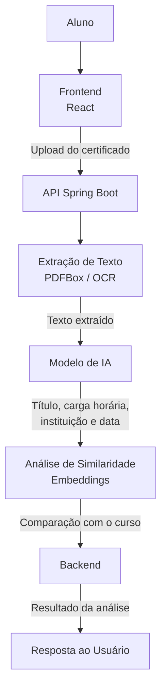

**Start Date:** 2026-07-30

**Authors:** Maria Eduarda Sousa Silva


# Sumário

Esta é uma proposta de implementação de um sistema para validação de certificados de horas complementares utilizando Inteligência Artificial. O sistema permitirá que estudantes enviem os certificados por meio de uma interface web, enquanto o backend será responsável por extrair informações relevantes do documento (título, carga horáriaa, instituição emissora e data de conclusão), analisar a sua compatibilidade com o curso informado e retornar as horas para o site do aluno. O objetivo é automatizar um processo atualmente realizado de forma manual, tornando-o mais rápido, padronizado e eficiente.


# Motivação

O processo de validação de horas complementares, além de demorado, exige atenção e análise cuidadosa das secretarias acadêmicas para garantir que os certificados atendam aos critérios institucionais.


Para compreender melhor a experiência do usuário, foram realizados testes utilizando o portal do aluno da faculdade. Durante o processo, foram encontradas dificuldades para identificar a categoria mais adequada para o certificado devido às opções disponíveis. Ao preencher o formulário, também foi identificado um limite de 10 horas no campo correspondente, o que gerou dúvidas sobre a aceitação do certificado ou se a restrição era apenas do sistema. Após o preenchimento das demais informações, foi registrado nas observações que o certificado era referente a um curso online e continha uma carga horária superior ao limite apresentado.

O envio foi concluído com sucesso, porém o sistema informou um prazo de até 30 dias para análise. Além disso, foi necessário entrar em contato com a secretaria acadêmica para esclarecer as dúvidas. Somente então foi possível confirmar que certificados de cursos online são aceitos e que a limitação de 10 horas era apenas uma restrição da interface, não da regra de validação.

Embora o preenchimento do formulário tenha levado aproximadamente cinco minutos, o processo evidenciou problemas de usabilidade, ambiguidades na interface e dependência de atendimento humano para esclarecer informações básicas.

Pensando nessa análise, foi realizado outro teste, dessa vez com foco em compreender o trabalho das secretarias acadêmicas. Constatou-se que, em média, são necessários 10 minutos de tempo de análise por certificado. Considerando um cenário com 30 alunos, o tempo total dedicado a esse processo chegaria a 300 minutos, o equivalente a 5 horas.

Diante desse cenário, o Hoursy propõe reduzir o tempo de análise dos certificados em até 96%, permitir que o usuário informe livremente a origem do certificado utilizando mecanismos de proteção contra injeção de prompt e tornar o processo mais intuitivo, reduzindo ambiguidades e a necessidade de contato com a coordenação para dúvidas recorrentes.

Como resultado, espera-se um sistema capaz de diminuir significativamente o trabalho manual das secretarias acadêmicas, sem eliminar a possibilidade de revisão humana quando necessária, tornando o processo mais ágil, confiável e eficiente.

# Design 

O sistema será composto por três módulos principais:
- Frontend
- Backend
- Serviço de IA

## Arquitetura



## Fluxo de operação

### Upload de certificado:
- O estudante informa o código do curso e o certificado (pdfs ou imagens) e o front envia uma requição multipart/form-data para API

**Exemplo:**
  POST `/api/certificados/analisar`


### Extração do conteudo:
- Após receber o arquivo, o back identifica o seu formato.

  PDFs digitais terão seu texto extraído utilizando Apache PDFBox

  PDFs escaneados ou imagens passarão por OCR

**Exemplo de texto:**

Maria Eduarda Sousa Silva

Concluiu o curso

Java Programming Foundations

Carga horária: 40 horas

Conclusão: 15/06/2026


### Extração estruturada utilizando IA
- O texto extraído será enviado para um modelo de IA resposável por identificar os principais dados do certificado

**Exemplo da resposta:**

```json
{
  "titulo": "Java Programming Foundations",
  "instituicao": "Oracle",
  "cargaHoraria": 40,
  "dataConclusao": "2026-06-15"
}
```

### Ánalise de compatibilidade
- O backend enviará para a IA:
  código do curso
  informações extraídas do certificado

- A IA deverá avaliar se o conteúdo possui relação com o curso escolhido e retornar:
  similaridade
  categoria
  aprovação
  justificativa

**Exemplo:**

```
{
  "similaridade": 0.94,
  "categoria": "Programação",
  "aprovado": true,
  "justificativa": "O certificado aborda programação em Java, conteúdo diretamente relacionado ao curso de Engenharia de Software."
}
```

### Resposta da API
- A API devolverá um objeto contendo tanto as informações extraídas quanto o resultado da análise

**Exemplo:**

```
{
  "certificado": {
  "titulo": "Java Programming Foundations",
  "instituicao": "Oracle",
  "cargaHoraria": 40,
  "dataConclusao": "2026-06-15"
},
  "analise": {
  "similaridade": 0.94,
  "categoria": "Programação",
  "aprovado": true,
  "justificativa": "O conteúdo é compatível com o curso informado."
}
}
```

# Limitações
A implementação apresenta alguns desafios importantes:

- O resultado da IA pode variar dependendo do modelo utilizado.

-  Certificados de baixa qualidade podem dificultar a extração do texto.

- O uso de APIs de IA pode gerar custos.

- Alguns certificados podem exigir análise humana devido à ambiguidade das informações.

- Cada instituição pode possuir critérios diferentes de validação, exigindo parametrização do sistema.


# Alternativas

## Comparação baseada em regras

  Uma alternativa seria utilizar apenas palavras-chave e expressões regulares para identificar o conteúdo dos certificados.


**Vantagens:**

Implementação simples.

Baixo custo.

Resultado determinístico.

**Desvantagens:**

Pouca flexibilidade.

Baixa capacidade de compreender contexto.

Necessidade constante de atualização das regras.


## Validação totalmente manual

  Outra alternativa seria manter o processo atual.

**Vantagens:**

Não exige desenvolvimento.

Permite análise humana completa.

**Desvantagens:**

Processo lento.

Pouca escalabilidade.

Alto custo operacional.

# Considerações
Esta proposta adiciona uma funcionalidade inédita ao sistema e não substitui nenhuma funcionalidade existente. Antes da implantação será necessário:

  - Configurar limites de upload - 

  - Validar formatos de arquivos.

  - Proteger as credenciais da IA.

  - Registrar os resultados das análises para auditoria.

  - Definir comportamento caso o serviço de IA fique indisponível.

# Questões em aberto
  Ainda existem alguns pontos que deverão ser definidos durante o desenvolvimento:

  - Qual modelo de IA apresenta o melhor equilíbrio entre custo e precisão?

  - Qual será o limite mínimo de similaridade para aprovação automática?

  - Quando uma análise deverá ser encaminhada para validação humana?

  - Como permitir que diferentes instituições configurem seus próprios critérios?

  - Como tratar certificados emitidos em outros idiomas?

  - Será necessário validar automaticamente a autenticidade dos certificados por meio de QR Code ou APIs das instituições emissoras?